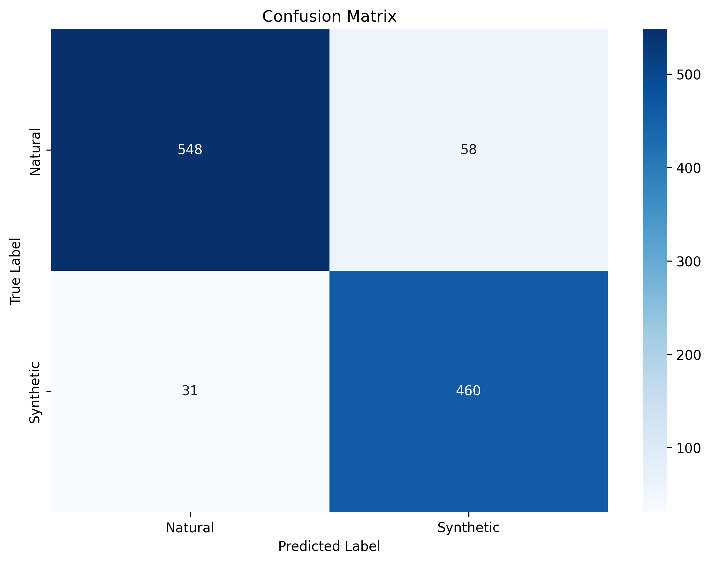
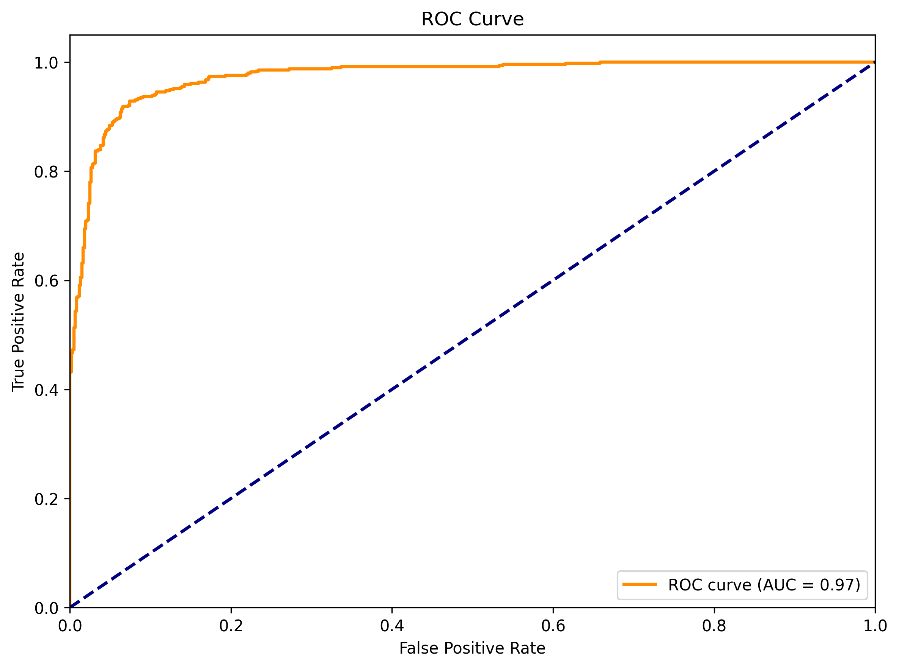

# 🕵️ AI-Generated Image Detector (Anime & Illustration)

[](https://www.python.org/)
[](https://pytorch.org/)
[](https://fastapi.tiangolo.com/)
[](https://huggingface.co/hirawaru/animeaidetect)

Dự án xây dựng hệ thống học sâu (Deep Learning) chuyên dụng để phân loại ảnh do AI tạo ra (**Synthetic**) và ảnh do họa sĩ vẽ (**Natural**). Mục tiêu chính là bảo vệ quyền sáng tác và giúp cộng đồng nghệ thuật số minh bạch hơn trong việc nhận diện nội dung.

---

## 🚀 Điểm nổi bật (Key Results)

Mô hình đã được huấn luyện qua 20 epochs với các chỉ số ấn tượng trên tập dữ liệu Test độc lập:

*   **Accuracy:** `91.89%`
*   **F1-Score:** `91.18%`
*   **ROC-AUC:** `97.37%`
*   **Kiến trúc:** EfficientNet-B3 (Transfer Learning từ ImageNet)

---

## 📊 Kết quả phân tích (Visualizations)

| Confusion Matrix | ROC Curve |
|:---:|:---:|
|  |  |

---

## 🏗️ Cấu trúc dự án (Project Structure)

```text
aidetect/
├── src/                  # Mã nguồn lõi (AI logic)
│   ├── model.py          # Kiến trúc mạng EfficientNet-B3/ResNet
│   ├── dataset.py        # Pipeline xử lý dữ liệu & Augmentation
│   ├── train.py          # Script huấn luyện chính
│   └── inference.py      # Lớp dự đoán ảnh đơn lẻ
├── web/                  # Ứng dụng Web
│   ├── app.py            # Backend API (FastAPI)
│   └── index.html        # Giao diện người dùng hiện đại
├── notebooks/            # Phân tích & Thử nghiệm
│   ├── 01_eda.ipynb      # Khám phá dữ liệu (EDA)
│   └── 02_results_analysis.ipynb
├── scripts/              # Công cụ hỗ trợ
│   ├── prepare_data.py   # Chia tập dữ liệu (70/15/15)
│   └── upload_to_hf.py   # Tự động hóa tích hợp Hugging Face
├── results_20epochs/     # Kết quả huấn luyện chính thức
│   ├── metrics.json      # Báo cáo thông số chi tiết
│   └── *.png             # Biểu đồ đánh giá
├── config.yaml           # Cấu hình hệ thống (Hyperparameters)
├── Dockerfile            # Đóng gói Container
└── README.md             # Hướng dẫn này
```

---

## 🛠️ Hướng dẫn cài đặt & Sử dụng

### 1. Cài đặt môi trường
Yêu cầu Python 3.11+.
```bash
# Tạo môi trường ảo
python -m venv venv
source venv/bin/activate  # Hoặc venv\Scripts\activate trên Windows

# Cài đặt thư viện
pip install -r requirements.txt
```

### 2. Sử dụng ứng dụng Web (Local)
Giao diện trực quan để upload và kiểm tra ảnh ngay lập tức:
```bash
# Chạy Backend API & Frontend
uvicorn web.app:app --host 0.0.0.0 --port 8000
```
Truy cập: `http://localhost:8000`

### 3. Huấn luyện lại mô hình
Nếu bạn có tập dữ liệu mới:
```bash
# Chia dữ liệu
python scripts/prepare_data.py

# Bắt đầu training (Tham số chỉnh trong config.yaml)
python src/train.py
```

---

## 🌐 Tích hợp Hugging Face (Inference Provider)

Dự án được triển khai dưới dạng **Inference Provider** tại: [hirawaru/animeaidetect](https://huggingface.co/hirawaru/animeaidetect)

### Gọi API bằng Python (Không cần cài đặt mô hình)
```python
import requests

API_URL = "https://api-inference.huggingface.co/models/hirawaru/animeaidetect"
headers = {"Authorization": "Bearer YOUR_HF_TOKEN"}

def predict(filename):
    with open(filename, "rb") as f:
        data = f.read()
    return requests.post(API_URL, headers=headers, data=data).json()

print(predict("test_image.jpg"))
```

### Sử dụng lệnh cURL
```bash
curl https://api-inference.huggingface.co/models/hirawaru/animeaidetect \
    -X POST --data-binary '@my_image.jpg' \
    -H "Authorization: Bearer YOUR_HF_TOKEN"
```

---

## 🐳 Docker Deployment

Đóng gói và chạy ứng dụng trong 1 câu lệnh (Tự động tải model từ HF Hub):

```bash
# Build & Run
docker-compose up --build
```
Hệ thống sẽ chạy tại cổng `8000`.

---
